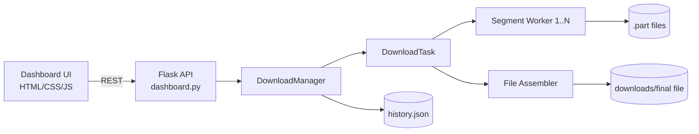

# Simple Download Manager (SDM)

Implementation of the distributed systems project described in **Simple Download Manager.pdf**.

## Features

- Download files from URL
- Multi-threaded segmented downloads using HTTP `Range`
- Pause / Resume / Cancel controls
- Automatic retry per segment (configurable)
- Live progress dashboard with:
  - percentage
  - speed
  - ETA
  - per-task status
- Persistent download history (`history.json`)
- Bandwidth limit (optional, per task)

## Architecture

This project uses a **layered architecture**:

1. UI Layer
- Flask web server + HTML/CSS/JS dashboard
- User actions: add task, pause/resume/cancel, refresh status

2. Download Manager Core
- `DownloadManager` tracks tasks and routes commands
- Persists history when tasks finish

3. Thread Controller + Workers
- `DownloadTask` coordinates one manager thread and N segment workers
- Each worker downloads a byte range to a `.part` file
- Retry with exponential backoff for transient failures

4. File Assembler
- Merges segment files in order to final output in `downloads/`
- Cleans temporary parts after completion/cancel

5. Persistence
- `history.json` stores completed/failed/cancelled task snapshots

### Component Diagram (Mermaid)



## Communication Mechanisms

- REST endpoints between browser and Flask backend
- Python threading and shared state for concurrent downloads
- HTTP `HEAD` and `GET` with `Range` for segmented transfer

## Project Structure

```text
.
├── dashboard.py
├── sdm/
│   ├── __init__.py
│   └── downloader.py
├── templates/
│   └── index.html
├── static/
│   ├── app.js
│   └── styles.css
├── requirements.txt
└── README.md
```

## Setup

```bash
python -m venv .venv
source .venv/bin/activate
pip install -r requirements.txt
python dashboard.py
```

Open: `http://127.0.0.1:5000`

## API Summary

- `GET /api/tasks` list tasks
- `POST /api/tasks` create task
- `POST /api/tasks/<id>/start` start task
- `POST /api/tasks/<id>/pause` pause task
- `POST /api/tasks/<id>/resume` resume task
- `POST /api/tasks/<id>/cancel` cancel task
- `GET /api/history` list persisted history

## Notes

- If a server does not expose `Content-Length`, segmented download is not possible in this version.
- If `Accept-Ranges` is not available, the task falls back to a single segment.
- Resume is supported while app is running and from temporary segment files existing in `downloads/`.

## Performance Comparison (single vs multi-threaded)

To include in report/demo:

1. Download same file with `segments=1` and then `segments=4/8`.
2. Record average speed and total completion time.
3. Compare performance by network/server behavior.
